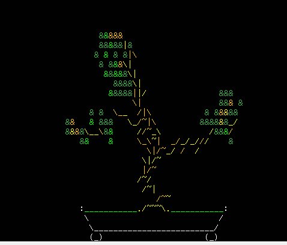
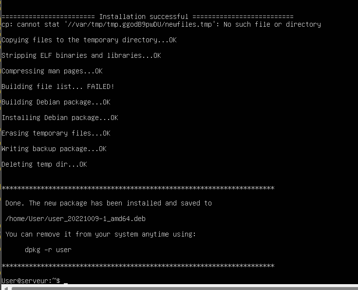
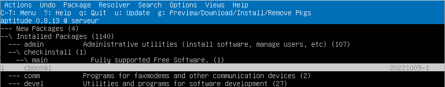
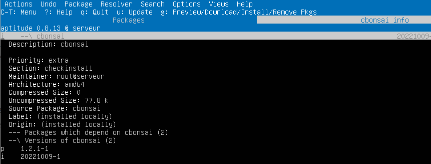

# TP4 - Gestion des paquets

Ce quatrième TP a pour but de vous faire prendre en main dpkg et le gestionnaire de paquets apt. Pour chaque question,
donnez une commande permettant d’obtenir le plus précisément possible le résultat demandé (i.e. en filtrant toutes les
informations superflues).

## Exercice 1 : Commandes de base

1. **Commencez par mettre à jour votre système avec les commandes vues dans le cours.**

```consol
    User@localhost:~$ sudo apt-get update
    User@localhost:~$ sudo apt-get upgrade
```

2. **Créez un alias “maj” de la ou des commande(s) de la question précédente. Où faut-il enregistrer cet alias pour qu’il ne soit pas perdu au prochain redémarrage ?**

Pour que cet alias ne soit pas perdu au prochain redémarrage il faut éditer le fichier bashrc du profil User. Rajouter les commandes précédentes en dessous de `some more ls aliases`. Ensuite à l'aide de la commande `source ~/.bashrc` on recharge le fihcier.

```consol
    User@localhost:~$ nano .bashrc

    # Some more ls aliases
    alias maj='sudo apt-get update ; sudo apt-get upgrade'

    User@localhost:~$ source ~/.bashrc
    User@localhost:~$ maj

```

3. **Utilisez le fichier /var/log/dpkg.log pour obtenir les 5 derniers paquets installés sur votre machine.**

```consol
    User@localhost:~$ grep installed /var/log/dpkg.log | tail -5
    2022-10-08 15:23 status installed pgthon3-gdbm:amd64 3.10.6-1~22.04
    2022-10-08 15:23 status installed man-db:amd64 2.10.2-1
    2022-10-08 15:23 status installed dbus:amd64 1.12.20-2ubuntu4
    2022-10-08 15:23 status installed install-info:amd64 6.8-4build1
    2022-10-08 15:23 status installed libc-bin:amd64 2.35-0ubuntu3.1
```

4. **Listez les derniers paquets qui ont été installés explicitement avec la commande apt install**

```consol
    User@localhost:~$ grep 'apt install' /var/log/apt/history.log
    Commandline: apt install net-tools
```

5. **Utilisez les commandes dpkg et apt pour compter de deux manières différentes le nombre de total de paquets installés sur la machine (ne pas hésiter à consulter le manuel !). Comment explique-t-on la (petite) différence de comptage ? Pourquoi ne peut-on pas utiliser directement le fichier dpkg.log ?**

```consol
    User@localhost:~$ dpkg -l |wc -l
    624
    User@localhost:~$ apt list --installed | wc -l

    WARNING: apt does not have a stable CLI interface. Use with caution in scripts.

    617
```
La différence entre dpkg et apt est que dpkg ne gère pas les dépendances, avec dpkg on ne peut installer que des fichiers locaux déjà téléchargés. Donc pour compter le nombre total de paquet installés sur la machine avec la commande dpkg on s'appérçoit qu'il ne liste pas uniquement les paquets installés

6. **Combien de paquets sont disponibles en téléchargement sur les dépôts Ubuntu ?**

```consol
    User@localhost:~$ apt list | wc -l

    WARNING: apt does not have a stable CLI interface. Use with caution in scripts.

    69086
```

7. **A quoi servent les paquets glances, tldr et hollywood ? Installez-les et testez-les.**

- Glances permet d'afficher l'état des principales ressources d'un système, de sa charge et du fonctionnement des applications. 
- tldr est une abréviation de `Too long; didn't read`, qui permet de simplifier le manuel. 
- Hollywood est un outil aussi inutile qu’indispensable et conçu dans le but de faire de nous un vrai faux hacker, comme à Hollywood.

Installer le paquet glaces
```consol
    User@localhost:~$ sudo apt-get install glaces
    User@localhost:~$ sudo update
    User@localhost:~$ glaces
```

Pour installer tldr il faut dabord installer le gestionnaire de paquets npm. 
```consol
    User@localhost:~$ sudo apt-get install npm
    User@localhost:~$ sudo update
    User@localhost:~$ sudo npm install -g tldr
    User@localhost:~$ tldr
```

Installer le paquet hollywood
```consol
    User@localhost:~$ sudo apt-get install hollywood
    User@localhost:~$ sudo update
    User@localhost:~$ hollywood
```

8. **Quels paquets proposent de jouer au sudoku**

A l'aide de la commande `apt search sudoku`, on peut trouver tous les paquets qui proposent de jouer au sudoku.

```consol
    User@localhost:~$ apt search sudoku
```

```consol
    User@localhost:~$ sudo apt-get install sudoku
    User@localhost:~$ sudo update
    User@localhost:~$ sudoku
```

## Exercice 2.

**A partir de quel paquet est installée la commande ls ? Comment obtenir cette information en une seule commande, pour n’importe quel programme ? Utilisez la réponse à cette question pour écrire un script appelé origine-commande (sans l’extension .sh) prenant en argument le nom d’une commande, et indiquant quel paquet l’a installée.**

```consol
    User@localhost:~$ dpkg -S ls | grep "/ls$"
    coreutils: /bin/ls
    klibc-utils: /usr/lib/klibc/bin/ls
```
Donc la commande ls est installée à partir du paquet coreutils et klibc-utils. 

```consol
    User@localhost:~$ nano origine-commande
    #!/bin/bash

    echo "La commande $1 a été installée à partir du(des) paquet(s) suivant(s) :"
    dpkg -S $1 | grep "/$1$"

    User@localhost:~$ chmod u+x origine-commande
    User@localhost:~$ ./origine-commande touch
    La commande touch a été installé à partir du(des) paquet(s) suivant(s) :
    coreutils: /bin/touch
    User@localhost:~$ ./origine-commande less
    La commande less a été installé à partir du(des) paquet(s) suivant(s) :
    less: /usr/bin/less
    less: /usr/lib/mime/packages/less
    less: /usr/share/doc/less
```

## Exercice 3.

**Ecrire une commande qui affiche “INSTALLÉ” ou “NON INSTALLÉ” selon le nom et le statut du package spécifié dans cette commande.**

```consol
    User@localhost:~$ dpkg -l "less" | grep "ii" && echo "INSTALLE" || echo "NON INSTALLE"
    ii  less           590-1build1  amd64        pager program similar to more
    INSTALLE
```
```consol
    User@localhost:~$ dpkg -l "van" | grep "ii" && echo "INSTALLE" || echo "NON INSTALLE"
    dpkg-query: no packages found matching van
    NON INSTALLE
```

## Exercice 4.

**Lister les programmes livrés avec coreutils. En particulier, on remarque que l’un deux se nomme [. Dequoi s’agit-il ?**

```consol
    User@localhost:~$ apt show coreutils

    Specifically, this package includes:
    arch base64 basename cat chcon chgrp chmod chown chroot cksum comm cp
    csplit cut date dd df dir dircolors dirname du echo env expand expr
    factor false flock fmt fold groups head hostid id install join link ln
    logname ls md5sum mkdir mkfifo mknod mktemp mv nice nl nohup nproc numfmt
    od paste pathchk pinky pr printenv printf ptx pwd readlink realpath rm
    rmdir runcon sha*sum seq shred sleep sort split stat stty sum sync tac
    tail tee test timeout touch tr true truncate tsort tty uname unexpand
    uniq unlink users vdir wc who whoami yes
```

On peut également lister les programmes livrés avec coreutils avec la commande `dpkg -L coreutils`, on trouve un programme qui se nomme [, ce programme est un alias pour la commande test. 

## Exercice 5. aptitude

**Installez les paquets emacs et lynx à l’aide de la version graphique d’aptitude (et prenez deux minutes pour vous renseigner et tester ces paquets).**

```consol
    User@localhost:~$ sudo apt-get install aptitude
    User@localhost:~$ sudo update
    User@localhost:~$ aptitude
```

Via l'interface `aptitude` à l'aide de ces commandes de base j'ai pu installer lynx et emacs, et les mettres à jour.
```consol
/ : recherche
n : poursuivre la recherche (next)
+ : sélectionner pour installation
g : une fois pour l’aperçu des changements, deux fois pour confirmer
- : suppression simple (= remove)
_ : suppression complète (= purge)
u : mise à jour de la liste des paquets (= update)
U : mise à jour des paquets (= upgrade)
```

Lynx est un navigateur Web basé sur du text. Emacs est un éditeur de text très puissant, extensible et personnalisable. Tous les deux utilisables via le terminal.

## Exercice 6. Installation d’un paquet par PPA

**Certains logiciels ne figurent pas dans les dépôts officiels. C'est le cas par exemple de la version "officielle" de Java depuis qu’elle est développée par Oracle. Dans ces cas, on peut parfois se tourner vers un ”dépôt personnel” ou PPA.**

1. **Installer la version Oracle de Java (avec l’ajout des PPA)**

```consol
    sudo add-apt-repository ppa:linuxuprising/java
    sudo apt update
    sudo apt install oracle-java15-installer
```

2. **Vérifiez qu’un nouveau fichier a été créé dans /etc/apt/sources.list.d. Que contient-il ?**

```consol
    User@localhost:~$ ls /etc/apt/sources.list.d
    linuxuprising-ubuntu-java-jammy.list

    User@localhost:~$ cat /etc/apt/sources.list.d/linuxuprising-ubuntu-java-jammy.list
    deb https://ppa.llaunchpadcontent.net/linuxuprising/ubuntu/java/ubuntu  jammy main
    # deb-src https://ppa.llaunchpadcontent.net/linuxuprising/ubuntu/java/ubuntu  jammy main
```

Ce fichier contient les nouveaux dépôts de paquets de java15

## Exercice 7. Installation d’un logiciel à partir du code source
 
**Lorsqu’un logiciel n’est disponible ni dans les dépôts officiels, ni dans un PPA, ou encore parce qu’on souhaite n’installer qu’une partie de ses fonctionnalités, on peut se tourner vers la compilation du code source. C’est ce que nous allons faire ici, avec le programme cbonsai (https://gitlab.com/jallbrit/cbonsai)**

1. **Commencez par cloner le dépôt git suivant :**

`git clone https://gitlab.com/jallbrit/cbonsai`

```consol
    User@localhost:~$ git clone https://gitlab.com/jallbrit/cbonsai
```

**Ceci permet de récupérer en local le code source du logiciel cbonsai.**

2. **Rendez vous dans le dossier cbonsai. Un fichier README.md) est livré avec les sources, et vous explique comment compiler le programme (vous pouvez installer un lecteur de Markdown pour Bash, comme mdless pour vous faciliter la lecture de ce type de fichiers).**

```consol
    User@localhost:~$ sudo snap install mdless
    User@localhost:~/cbonsai$ mdless README.md
```

**Un fichier Makefile est également présent. Un Makefile est un fichier utilisé par l’outil make, et contient toutes les directives de compilation d’un logiciel. Un Makefile définit un certain nombre de règles permettant de construire des cibles. Les cibles les plus communes étant install (pour la compilation et l’installation du logiciel) et clean (pour sa suppression).**

**En suivant les consignes du fichier README.md, et en installant les éventuels paquets manquants, compilez ce programme et installez le en local.**

```consol
    User@localhost:~$ sudo apt install cbonsai
    User@localhost:~$ sudo apt install libncursesw5-dev
    User@localhost:~$ sudo apt install make
    User@localhost:~$ make install PREFIX=~/.local
    User@localhost:~/ cbonsai$ cbonsai -l
```



3. **Malheureusement, cette installation “à la main” fait qu’on ne dispose pas des bénéfices de la gestion de paquets apportés par dpkg ou apt. Heureusement, il est possible de transformer un logiciel installé “à la main” en un paquet, et de le gérer ensuite avec apt ; c’est ce que permet par exemple l’outil checkinstall.**

```consol
    User@localhost:~/cbonsai$ sudo apt install checkinstall
    User@localhost:~/cbonsai$ sudo checkinstall cbonsai
```




4. **Recommencez la compilation à l’aide de checkinstall :**
`sudo checkinstall`

```consol
    User@localhost:~$ sudo checkinstall
```
Question précédente.

**Un paquet a été créé (fichier xxx.deb), et le logiciel est à présent installé (tapez cbonsai depuis n’importe quel dossier pour vous en assurer) ; on peut vérifier par exemple avec aptitude qu’il provient bien du paquet qu’on a créé avec checkinstall.**
**Vous pouvez à présent profiter d’un instant de zenitude avant de passer au dernier exercice.**

J'ai bien vérifié que le paquet `user_20221009-1_amd64.deb` a été créé et que le logiciel est à présent installé, si on tape cbonsai depuis n'importe qul dossier cela fonctionne. J'ai également vérifié avec aptitude qu'il provient bien du paquet qu'on avait créé avec checkinstall.





## Exercice 8. Création de dépôt personnalisé

**Dans cet exercice, vous allez créer vos propres paquets et dépôts, ce qui vous permettra de gérer les programmes que vous écrivez comme s’ils provenaient de dépôts officiels.**

## Création d’un paquet Debian avec dpkg-deb

1. **Dans le dossier scripts créé lors du TP 2, créez un sous-dossier origine-commande où vous créerez un sous-dossier DEBIAN, ainsi que l’arborescence usr/local/bin où vous placerez le script écrit à l’exercice 2**

```consol
    User@localhost:~$ cd script
    User@localhost:~/script$ mkdir origine-commande
    User@localhost:~/script$ cd origine-commande
    User@localhost:~/script/origine-commande$ mkdir DEBIAN
    User@localhost:~/script/origine-commande$ mkdir usr
    User@localhost:~/script/origine-commande$ cd usr
    User@localhost:~/script/origine-commande/usr$ mkdir local
    User@localhost:~/script/origine-commande/usr$ cd local
    User@localhost:~/script/origine-commande/usr/local$ mkdir bin
    User@localhost:~/script/origine-commande/usr/local$ cd bin
    User@localhost:~/script/origine-commande/usr/local/bin$ cp ~/origine-commande origine-commande
    User@localhost:~/script/origine-commande/usr/local/bin$ ls
    origine-commande

```

2. **Dans le dossier DEBIAN, créez un fichier control avec les champs suivants :**

```consol
    User@localhost:~/script/origine-commande/DEBIAN nano control
```
```consol
Package: origine-commande #nom du paquet
Version: 0.1 #numéro de version
Maintainer: Van SAHAKYAN #votre nom
Architecture: all #les architectures cibles de notre paquet (i386, amd64...)
Description: Cherche l'origine d'une commande
Section: utils #notre programme est un utilitaire
Priority: optional #ce n'est pas un paquet indispendable
```

3. **Revenez dans le dossier parent de origine-commande (normalement, c’est votre $HOME) et tapez la commande suivante pour construire le paquet :**

`dpkg-deb --build origine-commande`

```consol
    User@localhost:~/script$ dpkg-deb --build origine-commande
    dpkg-deb: building package 'origine-commande' in 'origine-commande.deb'
```

**Félicitations ! Vous avez créé votre propre paquet !**

## Création du dépôt personnel avec reprepro

1. **Dans votre dossier personnel, commencez par créer un dossier repo-cpe. Ce sera la racine de votre dépôt**

```consol
    User@localhost:~/script$ mkdir repo-cpe
```

2. **Ajoutez-y deux sous-dossiers : conf (qui contiendra la configuration du dépôt) et packages (qui contiendra nos paquets)**

```consol
    User@localhost:~/script/repo-cpe$ mkdir conf
    User@localhost:~/script/repo-cpe$ mkdir packages 
```

3. **Dans conf, créez le fichier distributions suivant :**

```consol
    User@localhost:~/script/repo-cpe/conf$ nano distributions
```
```consol
Origin: Un nom, une URL, ou tout texte expliquant la provenance du dépôt
Label: Nom du dépôt
Suite: stable
Codename: cosmic
Architectures: i386 amd64 
Components: universe 
Description: Une description du dépôt
```

4. **Dans le dossier repo-cpe, générez l’arborescence du dépôt avec la commande reprepro -b . export**

```consol
    User@localhost:~$ sudo apt install reprepro
    User@localhost:~/repo-cpe$ reprepro -b . export
```

5. **Copiez le paquet origine-commande.deb créé précédemment dans le dossier packages du dépôt, puis, à la racine du dépôt, exécutez la commande reprepro -b . includedeb cosmic origine-commande.deb afin que votre paquet soit inscrit dans le dépôt.**

```consol
    User@localhost:~$ cp script/origine-commande.deb repo-cpe/packages
    User@localhost:~$ reprepro -b . includedeb cosmic packages/origine-commande.deb
    Exporting indices...
```

6. **Il faut à présent indiquer à apt qu’il existe un nouveau dépôt dans lequel il peut trouver des logiciels. Pour cela, créez (avec sudo) dans le dossier /etc/apt/sources.list.d le fichier repo-cpe.list contenant :**

```consol
    User@localhost:~$ sudo nano /etc/apt/sources.list.d/repo-cpe.list
    deb file:/home/User/repo-cpe cosmic multiverse
```

`deb file:/home/VOTRE_NOM/repo-cpe cosmic multiverse`
**(cette ligne reprend la configuration du dépôt, elle est à adapter au besoin)**

7. **Lancez la commande sudo apt update.**

```consol
    User@localhost:~$ sudo apt update
```

**Féliciations ! Votre dépôt est désormais pris en compte ! ... Enfin, pas tout à fait... Si vous regardez la sortie d’apt update, il est précidé que le dépôt ne peut être pris en compte car il n’est pas signé. La signature permet de vérifier qu’un paquet provient bien du bon dépôt. On doit donc signer notre dépôt.**

## Signature du dépôt avec GPG

**GPG est la version GNU du protocole PGP (Pretty Good Privacy), qui permet d’échanger des données de manière sécurisée. Ce système repose sur la notion de clés de chiffrement asymétriques (une clé publique et une clé privée)**

1. **Commencez par créer une nouvelle paire de clés avec la commande `gpg --gen-key`**

```consol
    User@localhost:~$ gpg --gen-key
```

**Attention ! N’oubliez pas votre passphrase !!!**

2. **Ajoutez à la configuration du dépôt (fichier distributions la ligne suivante : `SignWith: yes`**

```consol
    SignWith: yes
```

J'ai donc rajouté la ligne demandée à la configuration du dépôt.

3. **Ajoutez la clé à votre dépôt : `reprepro --ask-passphrase -b . export`**

```consol
    User@localhost:~$ reprepro --ask-passphrase -b . export
```

**Attention ! Cette méthode n’est pas sécurisée et obsolète ; dans un contexte professionnel, on utiliserait plutot un gpg-agent.**

4. **Ajoutez votre clé publique à votre dépôt avec la commande `gpg --export -a "auteur" > public.key`**


```consol
    User@localhost:~$ gpg --export -a "van" > public.key
```

5. **Enfin, ajoutez cette clé à la liste des clés fiables connues de apt : `sudo apt-key add public.key`**

```consol
    User@localhost:~$ sudo apt-key add public.key
    Warning: apt-key is deprecated. Manage keyring files in trusted.gpg.d instead (see apt-key(8)).
    OK
```

**Félicitations ! La configuration est (enfin) terminée ! Vérifiez que vous pouvez installer votre paquet comme n’importe quel autre paquet**

```consol 
    User@localhost:~$ sudo apt install origine-commande
    Reading package lists... Done
    Building dependency tree
    Reading state information... Done
    The following NEW packages will be installed:
    origine-commande
    0 upgraded, 1 newly installed, 0 to remove and 0 not upgraded.
    Need to get 0 B/1,024 B of archives.
    After this operation, 4,096 B of additional disk space will be used.
    Selecting previously unselected package origine-commande.
    (Reading database ... 123456 files and directories currently installed.)
    Preparing to unpack .../origine-commande.deb ...
    Unpacking origine-commande (1.0) ...
    Setting up origine-commande (1.0) ...
```